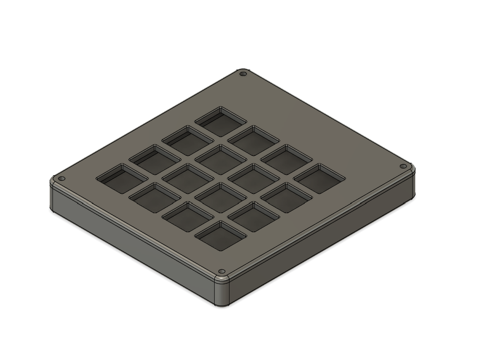
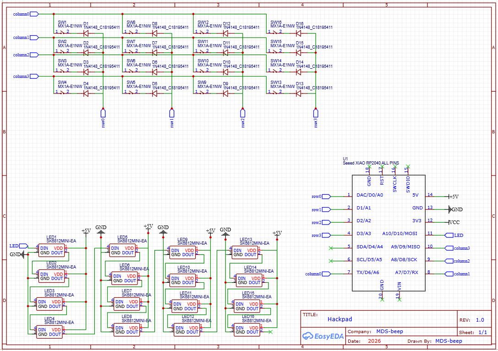
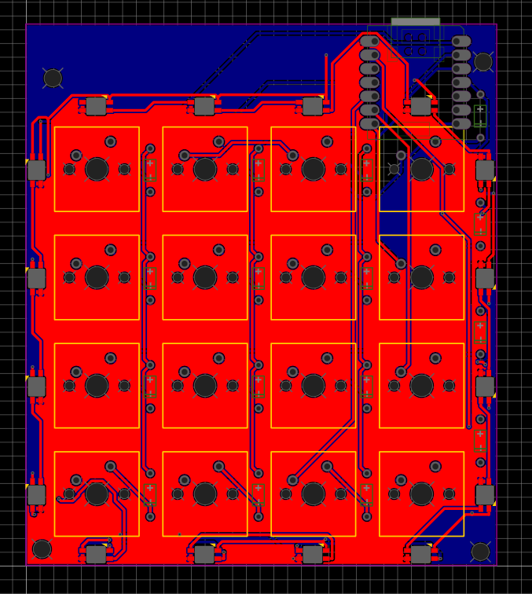
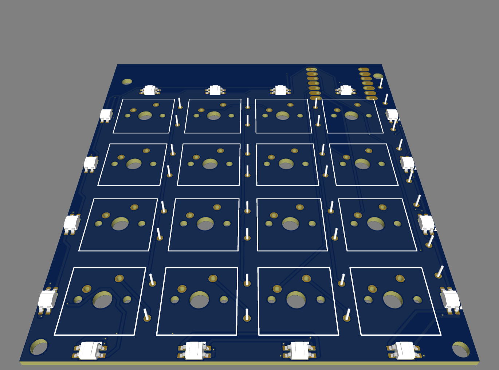

# 🛠 Hackpad  
### 4x4 RGB Mechanical Macropad powered by Seeed XIAO RP2040

---

## 📌 Project Description

Hackpad is a fully custom 4x4 mechanical macropad with per-key RGB lighting.  
It is powered by the Seeed XIAO RP2040 and operates as a programmable USB HID device.

The device scans a 4x4 key matrix, controls 16 addressable RGB LEDs, and runs custom firmware written in CircuitPython.

This project includes a complete PCB design, full CAD assembly, and working firmware.

---

## 🎯 How to Use

1. Connect the device using a USB-C cable.
2. The system will appear as a USB keyboard.
3. Edit the firmware file to assign custom macros or lighting behavior.
4. Save the firmware to the device storage.
5. Restart the board to apply changes.

The layout and functionality can be fully customized in software.

---

## 💡 Why This Project Was Built

This project was created to learn:

- Full PCB design workflow
- Designing a key matrix with diode protection
- Integrating addressable RGB LEDs
- Creating a complete CAD assembly with electronics
- Developing USB HID firmware
- Building a fully original embedded system project

All hardware, PCB, and enclosure designs were created from scratch.

---

## 📸 Project Screenshots 

### 🔹 Overall Hackpad (real photo soon) 
 
---
### 🔹 Schematic 

--- 

### 🔹 PCB Layout
 
--- 
### 🔹 PCB 3D View 

--- 
### 🔹 Case Design & Assembly 

---

## ⚙ Hardware Specifications

- 4x4 key matrix
- 16 mechanical switches (MX style)
- 16 SK6812 MINI-E addressable RGB LEDs
- 16 1N4148 diodes for anti-ghosting
- USB-C connection
- Fully custom PCB design
- 3D printed enclosure
- Heat-set insert mounting system
- CircuitPython firmware

---

## 🧾 Bill of Materials

| Qty | Component | Description | 
|-----|------------|------------|
| 1 | Seeed XIAO RP2040 | Microcontroller |
| 16 | MX Style Switches | Mechanical key switches |
| 16 | SK6812 MINI-E | Addressable RGB LEDs |
| 16 | 1N4148 | Signal diodes | 
| 1 | Custom PCB | Designed in KiCad/EasyEDA |
| 1 | 3D Printed Case | Custom enclosure | 
| 16 | Keycaps | MX compatible | 
| 4 | M3 Screws | Case mounting |
| 4 | M3 Heatset Inserts | Case mounting | 
| 1 | USB-C Cable | Power and data |

---

## 💻 Firmware

The device runs CircuitPython and functions as a USB HID macro pad.

### Current Features
- Key matrix scanning
- RGB LED control
- Custom key mapping

### Planned Features
- Multiple macro layers
- Profile switching
- Advanced lighting effects

Firmware files are included in the repository.

---

## 🛠 Tools Used

- EasyEDA for PCB design
- Fusion 360 for CAD modeling
- CircuitPython for firmware development
- 3D printing for enclosure production

---

## 📁 Repository Contents

- Complete PCB source files
- Gerber files
- Full CAD source file
- Exported STEP file
- Firmware files
- BOM in CSV format
- Project images

All files are organized into clear folders.

---

## 🚀 Project Status

This is a fully original custom hardware project with:

- Complete CAD assembly
- Fully designed PCB
- Organized repository structure
